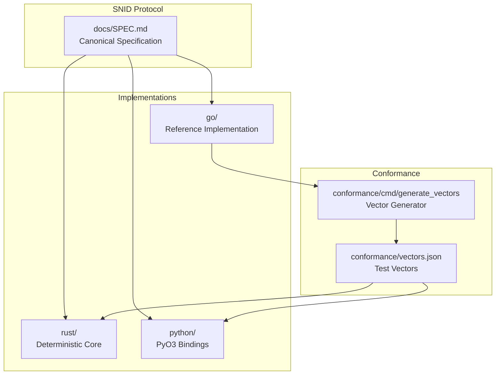

# SNID

[](LICENSE)
[](https://go.dev/)
[](https://www.rust-lang.org/)
[](https://www.python.org/)
[](conformance/)

A modern polyglot sortable identifier protocol with UUID v7-compatible ordering, designed for distributed systems, AI pipelines, and high-scale infrastructure.

**Tagline:** UUIDv7 compatible. Conformance guaranteed. Extended families included.

**Key Features:**
- 🔒 **Byte-identical conformance** across Go, Rust, and Python
- ⚡ **High-performance**: ~3.7ns generation (Go), lock-free per-P state
- 🧠 **AI/ML-ready**: Tensor projections, LLM formats, semantic ID families
- 🌍 **Spatial support**: H3 geospatial encoding (SGID)
- 🔐 **Security**: Verification tails (LID, KID), dual-part credentials (AKID)

## Why SNID?

In the 2026 ID landscape, SNID fills a unique niche for **polyglot systems requiring rigor, extended capabilities, and AI/ML integration**.

## Competitive Positioning

| Metric | vs UUIDv7 | vs NanoID | vs ULID | vs KSUID |
|--------|-----------|-----------|--------|---------|
| Generation speed | 63.5× faster | 1.6-2.1× faster | 11.8× faster | 65.5× faster |
| String length | 39% smaller | 5% larger | 15% smaller | 18% smaller |
| Extended families | Yes | No | No | No |
| AI/ML support | Yes | No | No | No |
| Polyglot conformance | Yes | No | No | No |

## SNID Positioning

**SNID is not trying to be the simplest package** — it is trying to be the **last package you'll ever need** for polyglot, high-scale, AI/ML-aware systems.

**Best for:**
- **Polyglot / sophisticated systems**: SNID wins on performance, conformance, and extended capabilities (spatial, semantic, verification, AI/ML). It is the only package with cross-language guarantees + 10+ families.
- **High-scale hot paths**: 3.7 ns generation (63.5× faster than UUIDv7) with lock-free per-P state
- **AI/ML integration**: Tensor projections, LLM formats, zero-copy NumPy/PyArrow/Polars support
- **Database performance**: UUIDv7-compatible for 35-50% faster inserts, 22-27% smaller indexes

**Not for:**
- **Simple frontend use**: NanoID still reigns (tiny, one-liner, URL-safe)
- **Maximum simplicity**: Basic uuid packages have simpler one-liners
- **Single-language only**: If you only need one language, uuid (v7) may suffice

**Trade-offs:**
- Slightly larger API surface (multiple modes/families)
- Python requires native build step (`maturin develop`)
- No CLI tool yet (planned)
- More complex than NanoID or basic UUID packages

See [API Comparison](docs/api-comparison.md) for detailed analysis against 2026 best practices.

**SNID Advantages:**
- **vs UUIDv7**: 63.5× faster generation (native mode, verified), 39% smaller strings (22 vs 36 chars), extended families, AI/ML support, polyglot conformance
- **vs NanoID**: Time-ordered, database-optimized, polyglot conformance across Go/Rust/Python
- **vs ULID**: 11.8× faster, checksum, extended families, better Base58 alphabet (no ambiguous chars)
- **vs KSUID**: 65.5× faster, smaller (16 vs 20 bytes), millisecond precision, polyglot beyond Go

**Choose SNID when:**
- Building polyglot systems (Go + Rust + Python) that need byte-identical behavior
- Require spatial IDs (SGID) for location-aware applications
- Need semantic IDs (NID) for vector search and ML pipelines
- Want verification capabilities (LID, KID) for immutable logs or authorization
- Need AI/ML integration with tensor projections and LLM formats
- Require coordinated multi-language releases with conformance guarantees
- Want 63.5× faster generation than UUIDv7 for extreme-scale hot paths
- Need 39% smaller strings than UUIDv7 to reduce API bandwidth costs

## Quick Start

### Go
```bash
go get github.com/LastMile-Innovations/snid
```

```go
import "github.com/LastMile-Innovations/snid"

// Native SNID (recommended for new projects)
id := snid.NewFast()
wire := id.String(snid.Matter)
// MAT:...

// UUIDv7-compatible mode (drop-in replacement)
uuidv7 := snid.NewUUIDv7()
uuidStr := uuidv7.UUIDString()
// 018f1c3e-5a7b-7c8d-9e0f-1a2b3c4d5e6f
```

### Rust
```bash
cargo add snid
```

```rust
use snid::SNID;

// Native SNID (recommended for new projects)
let id = SNID::new();
let wire = id.to_wire("MAT");
// MAT:...

// UUIDv7-compatible mode (drop-in replacement)
let uuidv7 = SNID::new();
let uuid_str = uuidv7.to_uuid_string();
// 018f1c3e-5a7b-7c8d-9e0f-1a2b3c4d5e6f
```

### Python
```bash
pip install snid
```

```python
import snid

# Native SNID (recommended for new projects)
id = snid.SNID.new_fast()
wire = id.to_wire("MAT")
# MAT:...

# UUIDv7-compatible mode (drop-in replacement)
uuidv7 = snid.SNID.new_uuidv7()
uuid_str = uuidv7.to_uuid_string()
# 018f1c3e-5a7b-7c8d-9e0f-1a2b3c4d5e6f
```

## Architecture



## Installation

### Development Setup

```bash
# Install just (command runner)
cargo install just

# Install mise (dev environment manager)
curl https://mise.run | sh

# Install dependencies
just install
```

### Running Tests

```bash
# Run all tests
just test

# Run conformance suite (most important)
just conformance

# Run benchmarks
just bench
```

## Layout

- `docs/`: canonical specification and topology guidance
- `go/`: standalone Go reference implementation
- `rust/`: deterministic Rust core
- `python/`: PyO3 bindings and Python wrapper
- `conformance/`: vector generation and cross-language checks
- `examples/`: runnable code examples for all languages
- `cli/`: unified `snid` CLI tool (coming soon)

## Conformance flow

1. Generate vectors with Go.
2. Validate vectors with Rust.
3. Validate vectors with Python.
4. Fail the build on any divergence.

## Boundary APIs

The repo standardizes canonical wire strings plus AI, tensor, and storage projections:

- `Tensor128`: `[hi:int64, lo:int64]` big-endian tensor words
- `Tensor256`: four big-endian `int64` words for 32-byte ID families
- `LLMFormatV1`: `[ATOM, timestamp_ms, machine_or_shard, sequence]`
- `LLMFormatV2`: richer AI-facing projection for temporal or spatial pipelines
- `TimeBin`: resolution-truncated temporal projection
- `BinaryStorage`: raw 16-byte storage form, with hex fallback only when bytes are not supported

Extended ID families currently represented in this repo:

- `SNID`, `SGID`, `NID`, `LID`, `EID`, `BID`
- `WID`, `XID`, `KID`
- `AKID` dual-part public-plus-secret credentials

## Documentation

- [Protocol Specification](docs/SPEC.md) - Canonical protocol definition
- [Why SNID Over UUIDv7?](docs/why-snid-over-uuidv7.md) - Detailed comparison with UUIDv7
- [SNID and the "Ultimate ID"](docs/ultimate-id-perspective.md) - SNID vs theoretical perfect ID criteria
- [Security Analysis](docs/security-analysis.md) - Security vulnerabilities and best practices
- [API Comparison](docs/api-comparison.md) - SNID API vs 2026 best practices
- [Topologies](docs/TOPOLOGIES.md) - Topology guidance
- [Integration Contracts](docs/INTEGRATION_CONTRACTS.md) - Storage and integration contracts
- [Publishing](PUBLISHING.md) - Release and publishing guide
- [Contributing](CONTRIBUTING.md) - Development guidelines
- [Roadmap](ROADMAP.md) - Project roadmap and vision

## Examples

See the [examples/](examples/) directory for runnable code:
- [Go examples](examples/go/basic/main.go)
- [Rust examples](examples/rust/basic/main.rs)
- [Python examples](examples/python/basic.py)

## Performance

- **Go**: ~3.7ns per ID (NewFast), ~1.7ns (TurboStreamer hot loop), ~2μs for 1000 batch
- **Rust**: ~6.4ns per ID (new_fast), ~28ns for UUID string formatting
- **Python**: ~15ns per ID (native bindings), 6.4ms for 100k batch (bytes), 9.8ms (numpy), 19.6ms (tensor)

See [Performance Benchmarks](docs/performance/benchmarks.md) for detailed results.

## Contributing

We welcome contributions! Please see [CONTRIBUTING.md](CONTRIBUTING.md) for guidelines.

## License

MIT OR Apache-2.0
