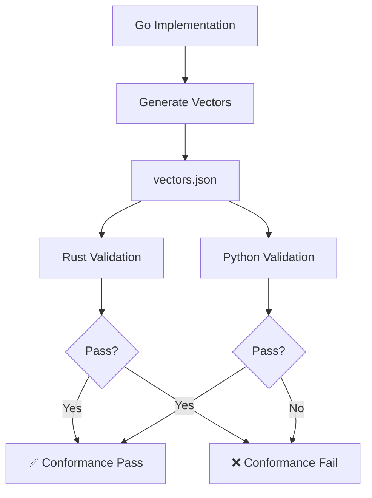

# Conformance Design

Cross-language conformance testing architecture.

## Overview

SNID ensures byte-identical behavior across Go, Rust, and Python through:
- Canonical test vectors generated by Go
- Validation by all implementations
- CI/CD gate that fails on any divergence
- Release artifact: `conformance/vectors.json`

## Conformance Flow



## Vector Generation

### Go (Authoritative)

```bash
cd conformance/cmd/generate_vectors
go run . --out ../../vectors.json
```

### Vector Format

```json
{
  "version": "1.0",
  "generated_at": "2024-01-01T00:00:00Z",
  "vectors": [
    {
      "name": "basic_new_fast",
      "input": {},
      "output": {
        "bytes": "base64_encoded_bytes",
        "wire": "MAT:2xXFhP9w7V4sKjBnG8mQpL",
        "uuid": "01234567-89ab-cdef-0123-456789abcdef"
      }
    }
  ]
}
```

## Validation

### Rust

```bash
cd rust
cargo test
```

Rust tests load `vectors.json` and validate:
- Parse/encode roundtrip
- Wire format correctness
- UUID compatibility
- Tensor projections

### Python

```bash
cd python
python -m unittest discover -s tests
```

Python tests load `vectors.json` and validate:
- Parse/encode roundtrip
- Wire format correctness
- Batch generation
- Tensor operations

## Conformance Categories

### Core Operations

- `NewFast()` - Single ID generation
- `NewBatch()` - Batch generation
- `FromString()` - Wire format parsing
- `String()` - Wire format encoding
- `UUID()` - UUID conversion

### Extended Operations

- `NewSpatial()` - SGID generation
- `NewNeural()` - NID generation
- `NewLID()` - LID generation
- Tensor projections
- Boundary projections

### Edge Cases

- Clock rollback handling
- Sequence overflow
- Invalid wire formats
- Checksum failures
- Atom normalization

## CI/CD Integration

### GitHub Actions

```yaml
name: Conformance

on: [push, pull_request]

jobs:
  conformance:
    runs-on: ubuntu-latest
    steps:
      - uses: actions/checkout@v3
      
      - name: Generate vectors
        run: |
          cd conformance/cmd/generate_vectors
          go run . --out ../../vectors.json
      
      - name: Validate Rust
        run: |
          cd rust
          cargo test
      
      - name: Validate Python
        run: |
          cd python
          python -m unittest discover -s tests
```

## Local Testing

### Using just

```bash
just conformance
```

This runs:
1. Vector generation with Go
2. Rust validation
3. Python validation

### Manual Testing

```bash
# Generate vectors
cd conformance/cmd/generate_vectors
go run . --out ../../vectors.json

# Validate Rust
cd rust && cargo test

# Validate Python
cd python && python -m unittest discover -s tests
```

## Adding New Vectors

When adding new test cases:

1. Update `conformance/cmd/generate_vectors/main.go`
2. Add new vector generation logic
3. Regenerate vectors: `just conformance`
4. Commit updated `vectors.json`
5. Verify all implementations pass

## Versioning

Vectors are versioned to track protocol changes:

```json
{
  "version": "1.0",
  "protocol_version": "5.3"
}
```

When protocol changes:
1. Bump vector version
2. Regenerate all vectors
3. Update all implementations
4. Update CI/CD to use new version

## Failing Conformance

If conformance fails:

1. Identify which implementation fails
2. Check vector generation logic
3. Check implementation parsing/encoding
4. Fix the issue
5. Regenerate vectors if needed
6. Re-run conformance

## Release Gate

Conformance is the non-negotiable release gate:

- All implementations must pass
- No release without conformance pass
- CI/CD blocks on conformance failure
- Manual verification for protocol changes

## Implementation Details

### Go Vector Generator

See `conformance/cmd/generate_vectors/main.go`

### Rust Validation

See `rust/tests/vectors.rs`

### Python Validation

See `python/tests/test_vectors.py`

## Best Practices

1. **Never commit vectors without regenerating** from Go
2. **Always run conformance** before committing
3. **Test protocol changes** with new vectors
4. **Keep vectors minimal** but comprehensive
5. **Document vector changes** in commit messages

## Next Steps

- [Generator Design](generator-design.md) - ID generation
- [Encoding Design](encoding-design.md) - Base58 encoding
- [Diagrams](diagrams.md) - Architecture diagrams
