# Architecture Diagrams

Visual representations of SNID architecture and components.

## System Architecture

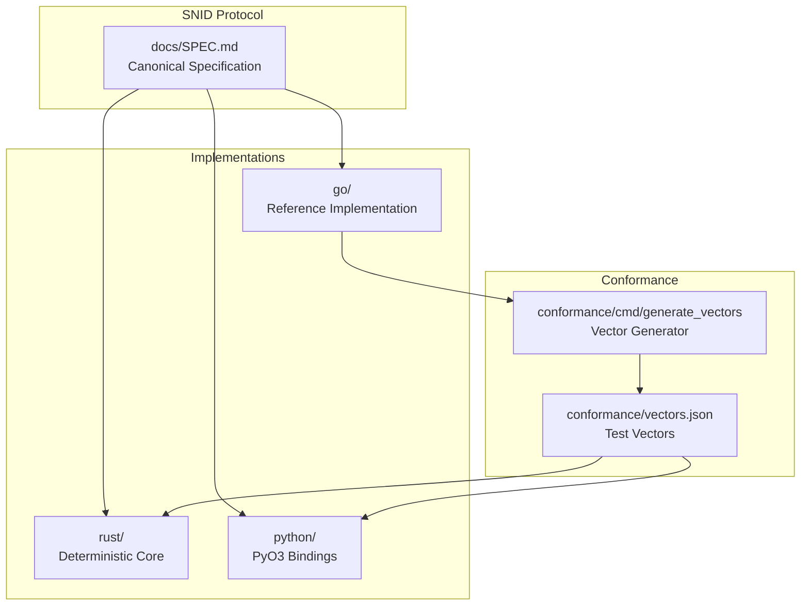

## ID Generation Flow

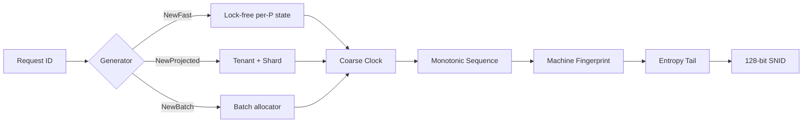

## Conformance Testing Flow

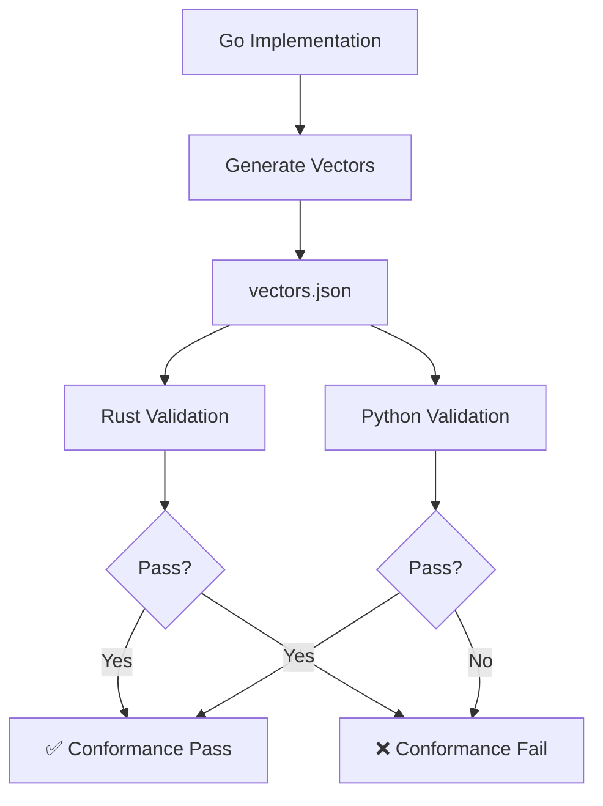

## Byte Layout

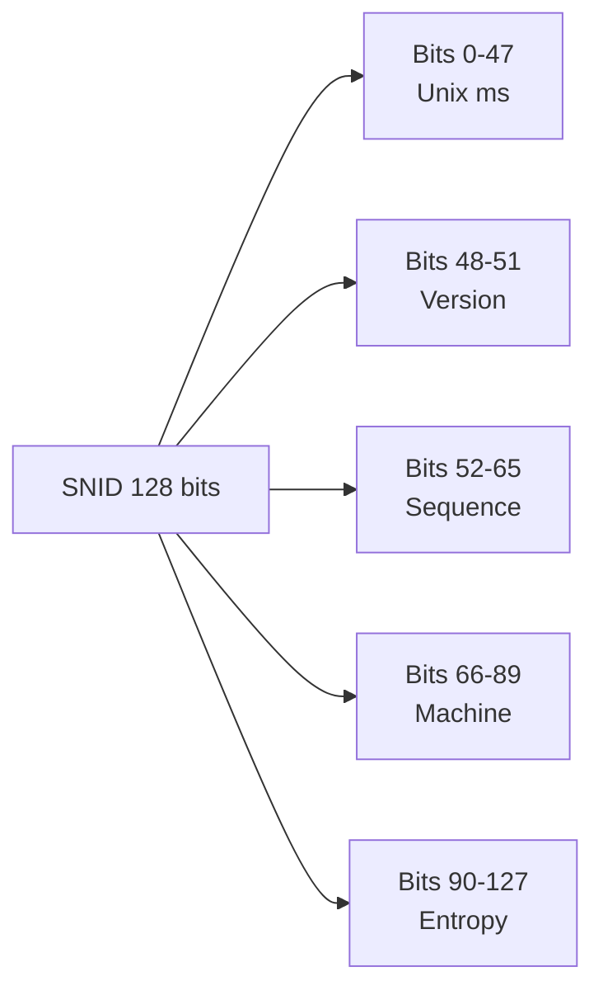

## Wire Format Encoding

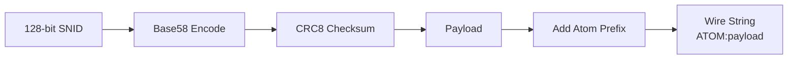

## Extended ID Families

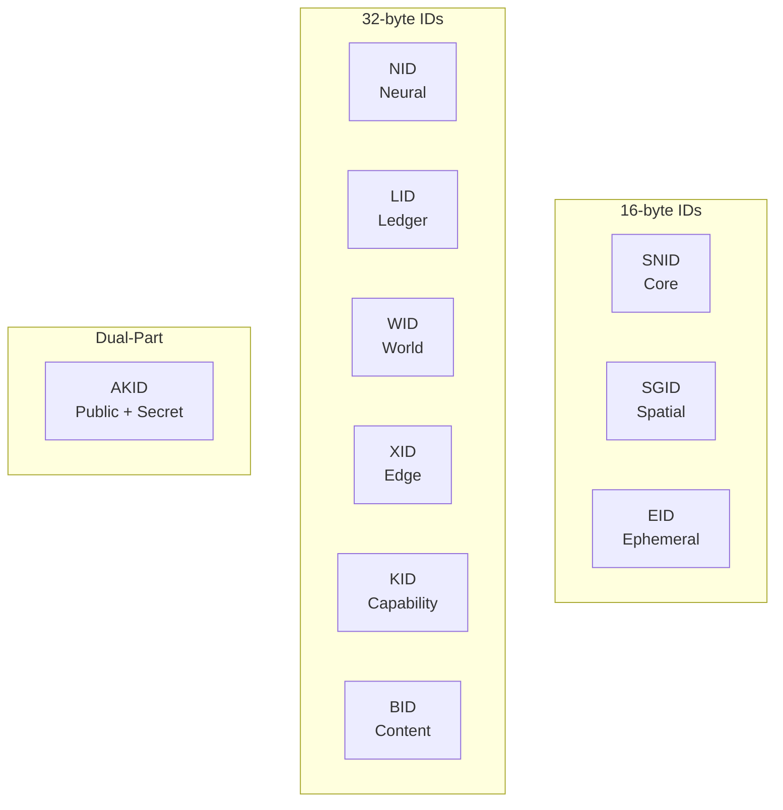

## Tensor Projections

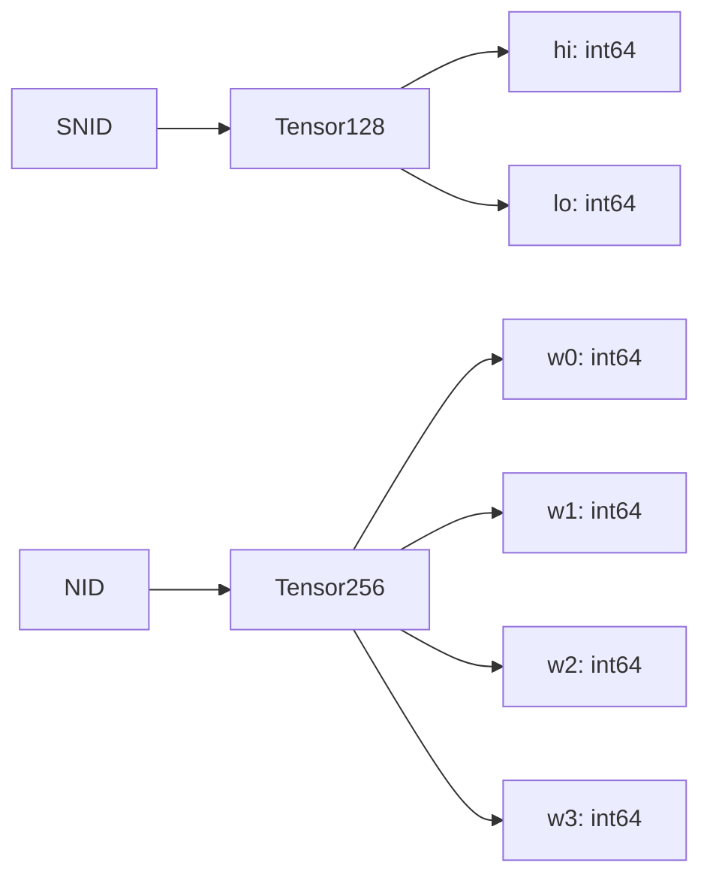

## Database Storage Contracts

```mermaid
graph TB
    A[SNID] --> B{Storage Engine}
    B -->|PostgreSQL| C[UUID or BYTEA]
    B -->|ClickHouse| D[FixedString 16]
    B -->|MySQL| E[BINARY 16]
    B -->|SQLite| F[BLOB]
    B -->|Neo4j| G[byte[]]
    B -->|Redis| H[Raw bytes]
```

## Batch Generation (Python)

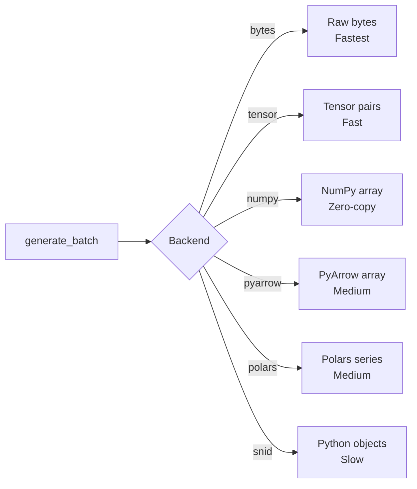

## AI/ML Pipeline Integration

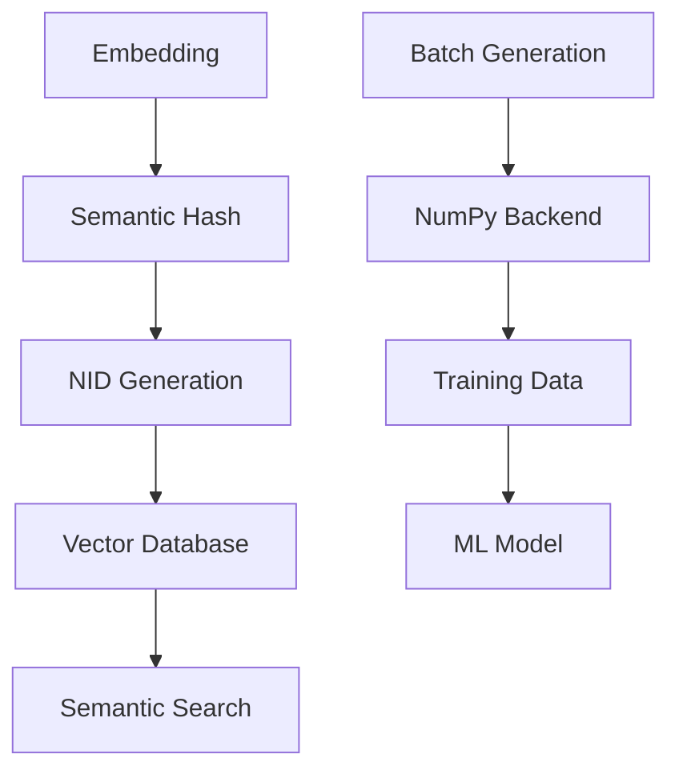

## Spatial ID (SGID) Flow

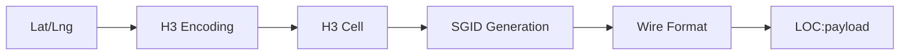

## Development Workflow

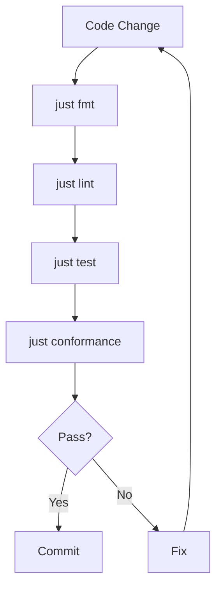

## Release Process

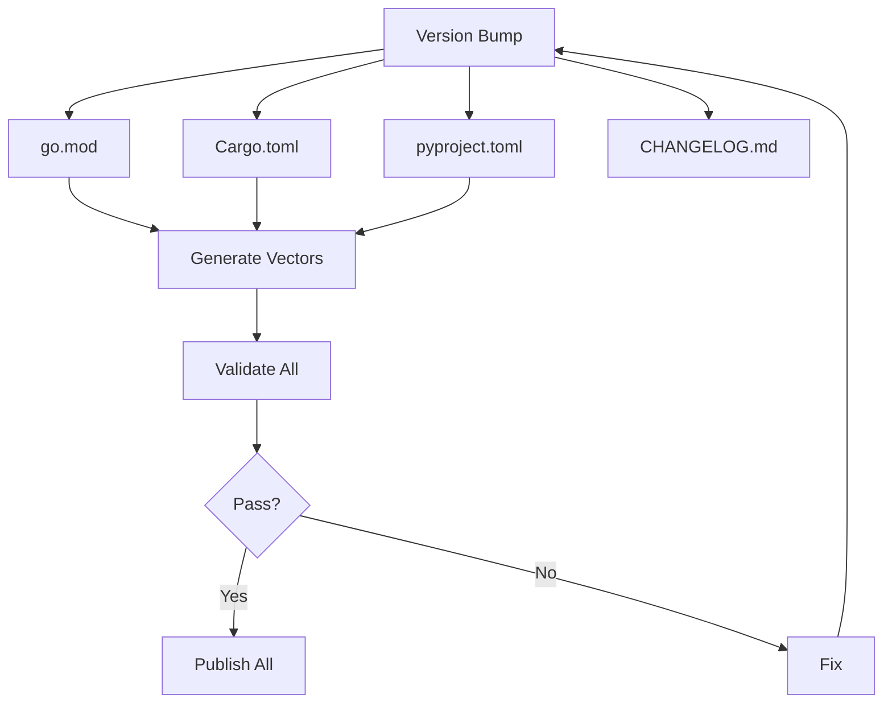

## CLI Architecture (Planned)

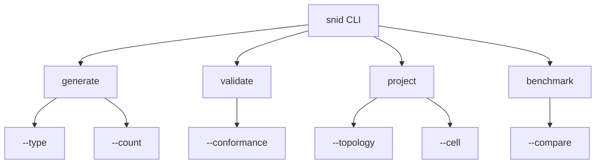
