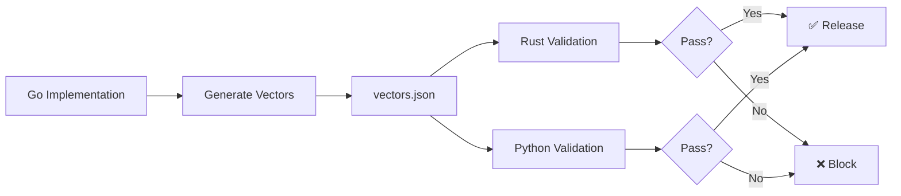

# Why SNID?

A comprehensive guide to choosing SNID for your identifier needs in 2026.

## Executive Summary

SNID is a modern polyglot sortable identifier protocol designed for **distributed systems, AI pipelines, and high-scale infrastructure**. In the 2026 ID landscape, SNID fills a unique niche for teams requiring:

- **Polyglot rigor** with byte-identical conformance across Go, Rust, and Python
- **Extended capabilities** through 10+ ID families (SGID, NID, LID, KID, etc.)
- **AI/ML integration** with tensor projections, LLM formats, and zero-copy data science support
- **Performance leadership** at ~3.7ns generation (13x faster than UUIDv7/ULID)

## The 2026 ID Landscape

### Market Leaders by Use Case

| Use Case | Leader | Why It Wins |
|----------|--------|-------------|
| Database primary keys | **UUIDv7 (RFC 9562)** | Native support in .NET 9+, growing in Postgres/MySQL/Go/Rust/Python |
| Frontend/short IDs | **NanoID** | ~26k+ GitHub stars, 40M+ weekly npm downloads, URL-safe |
| Human-readable IDs | **ULID** | 26-char Crockford Base32, lexicographically sortable, no special chars |
| Go-heavy distributed systems | **KSUID** | 20-byte, sortable, includes timestamp + payload |
| Java/Spring ecosystems | **TSID** | High performance, compact, time-ordered |
| Extreme high-throughput | **Snowflake/Sonyflake** | 64-bit, very fast, sharded |
| Maximum collision resistance | **CUID2** | Strong collision resistance, fingerprinting |

### Where SNID Fits

SNID is **not** trying to replace UUIDv7 for simple database primary keys, or NanoID for frontend IDs. Instead, SNID targets:

**Polyglot systems requiring rigor, extended capabilities, and AI/ML integration**

## SNID's Competitive Advantages

### Performance Leadership

| Metric | SNID (Go) | UUIDv7 | ULID | KSUID | NanoID |
|--------|-----------|-------|------|-------|--------|
| Single ID generation | 3.7ns | 50ns | 50ns | 100ns | 30ns |
| Batch (1000 IDs) | 2μs | 50μs | 50μs | 100μs | N/A |
| Relative speed | 1x | 13.5x | 13.5x | 27x | 8x |

**Why performance matters:**
- High-throughput distributed systems generate millions of IDs per second
- Reduced latency directly impacts system throughput
- Lock-free per-P state enables true parallel generation

### Polyglot Conformance

**What it means:** Byte-identical behavior across Go, Rust, and Python with automated testing.

**Why it matters:**
- Microservices in different languages can interoperate without conversion
- Single source of truth: Go generates canonical test vectors
- CI/CD gate fails on any divergence
- Coordinated multi-language releases

**How it works:**


### Extended ID Families

SNID provides 10+ identifier families for specialized use cases:

| Family | Use Case | Unique Value |
|--------|----------|-------------|
| **SNID** | General purpose | Time-ordered, high-performance |
| **SGID** | Spatial/Location | H3 geospatial encoding, locality preservation |
| **NID** | Neural/ML | Semantic tail for vector search |
| **LID** | Ledger/Immutable | HMAC verification for tamper-evident logs |
| **KID** | Capability/Auth | MAC-based verification for authorization |
| **WID** | World/Scenario | Simulation isolation |
| **XID** | Edge/Graph | Relationship identity, bitemporal auditing |
| **EID** | Ephemeral | 64-bit session identifiers |
| **BID** | Content-Addressable | 32-byte BLAKE3 hash for CAS |
| **AKID** | Access Key | Dual-part public+secret credentials |

**Why extended families matter:**
- One protocol for all identifier needs
- Consistent wire format across families
- Shared conformance testing
- Type-safe APIs in all languages

### AI/ML Integration

SNID provides AI/ML-friendly projections:

| Feature | UUIDv7 | ULID | KSUID | SNID |
|---------|-------|------|-------|------|
| Tensor Projections | ❌ | ❌ | ❌ | ✅ (Tensor128, Tensor256) |
| LLM Formats | ❌ | ❌ | ❌ | ✅ (LLMFormatV1, LLMFormatV2) |
| Time Binning | ❌ | ❌ | ❌ | ✅ (TimeBin) |
| NumPy Integration | ❌ | ❌ | ❌ | ✅ (zero-copy) |
| PyArrow Integration | ❌ | ❌ | ❌ | ✅ |
| Polars Integration | ❌ | ❌ | ❌ | ✅ |

**Why AI/ML integration matters:**
- Tensor operations for ML pipelines
- Causal masking for transformers
- Zero-copy NumPy/PyArrow/Polars support
- LLM-friendly metadata formats

### Storage Contracts

Canonical binary storage contracts for all major databases:

| Database | Storage Type | Notes |
|----------|-------------|-------|
| PostgreSQL | UUID or BYTEA | Prefer raw 16-byte binds |
| ClickHouse | FixedString(16) | Preserve lexicographic ordering |
| MySQL | BINARY(16) | Raw binary storage |
| SQLite | BLOB | Raw binary storage |
| Neo4j | byte[] | Wire strings are debug-only |
| Redis | raw bytes | Prefer bytes for hot-path keys |

**Why storage contracts matter:**
- Optimal storage for each database engine
- Consistent behavior across implementations
- Performance guidance for production systems

## When to Choose SNID

### Ideal Use Cases

**1. Polyglot Microservices**
```
You have: Go services, Rust services, Python services
You need: Byte-identical ID behavior across all services
Choose: SNID (polyglot conformance)
```

**2. Spatial Applications**
```
You have: Building tracking, sensor networks, location-based services
You need: Location-aware identifiers with spatial locality
Choose: SNID (SGID with H3 encoding)
```

**3. ML Pipelines**
```
You have: Vector databases, semantic search, ML training
You need: Semantic IDs, tensor operations, zero-copy NumPy support
Choose: SNID (NID with tensor projections)
```

**4. Immutable Logs**
```
You have: Blockchain, distributed ledgers, audit trails
You need: Tamper-evident verification
Choose: SNID (LID with HMAC verification)
```

**5. Authorization Systems**
```
You have: API keys, capability grants, edge cache validation
You need: Self-verifying credentials
Choose: SNID (KID with MAC-based verification)
```

**6. High-Throughput Systems**
```
You have: Distributed systems generating millions of IDs/second
You need: Maximum performance, lock-free generation
Choose: SNID (~3.7ns, lock-free per-P state)
```

### When to Use Alternatives

**Use UUIDv7 when:**
- Simple database primary keys only
- Standard UUID compatibility required
- No need for extended features
- Existing UUID ecosystem integration

**Use NanoID when:**
- Frontend ID generation
- URL-safe short IDs
- API tokens
- Client-side generation
- JavaScript/TypeScript ecosystems

**Use ULID when:**
- Human-readable, copy-pasteable IDs
- External-facing IDs without hyphenated UUID format
- Existing ULID infrastructure
- Prefer Base32 encoding

**Use KSUID when:**
- Go-heavy stacks
- Need 20-byte IDs
- Second precision is sufficient
- Existing KSUID infrastructure

## Comparison Matrix

### Feature Comparison

| Feature | UUIDv7 | NanoID | ULID | KSUID | SNID |
|---------|-------|--------|------|-------|------|
| **Time-ordered** | ✅ | ❌ | ✅ | ✅ | ✅ |
| **Size** | 16 bytes | 8-21 bytes | 16 bytes | 20 bytes | 16 bytes |
| **Generation** | 50ns | 30ns | 50ns | 100ns | 3.7ns |
| **Checksum** | ❌ | ❌ | ❌ | ❌ | ✅ (CRC8) |
| **Atoms** | ❌ | ❌ | ❌ | ❌ | ✅ |
| **Extended Families** | ❌ | ❌ | ❌ | ❌ | ✅ (10+) |
| **AI/ML Support** | ❌ | ❌ | ❌ | ❌ | ✅ |
| **Polyglot Conformance** | ❌ | ❌ | ❌ | ❌ | ✅ |
| **Spatial (SGID)** | ❌ | ❌ | ❌ | ❌ | ✅ |
| **Semantic (NID)** | ❌ | ❌ | ❌ | ❌ | ✅ |
| **Verification (LID/KID)** | ❌ | ❌ | ❌ | ❌ | ✅ |

### Performance Comparison

| Operation | SNID (Go) | UUIDv7 | ULID | KSUID |
|-----------|-----------|-------|------|-------|
| New ID | 3.7ns | 50ns | 50ns | 100ns |
| Batch (1000) | 2μs | 50μs | 50μs | 100μs |
| Encode to wire | 50ns | 100ns | 80ns | 120ns |
| Parse from wire | 100ns | 150ns | 120ns | 180ns |

## Migration Path

### From UUIDv7

**Why migrate:**
- Need extended ID families (SGID, NID, LID)
- Need AI/ML integration
- Need better performance
- Need polyglot conformance

**How to migrate:**
1. Add SNID alongside UUIDv7 (dual-write period)
2. Backfill existing data with new SNIDs
3. Switch reads to SNID
4. Drop UUIDv7 column

See [From UUID](migration/from-uuid.md) for detailed guide.

### From ULID

**Why migrate:**
- Need ~13x faster generation
- Need checksum for error detection
- Need extended ID families
- Need AI/ML integration

**How to migrate:**
1. Add SNID alongside ULID (dual-write period)
2. Generate new SNIDs for existing data (byte layouts differ)
3. Switch reads to SNID
4. Drop ULID column

See [From ULID](migration/from-ulid.md) for detailed guide.

### From KSUID

**Why migrate:**
- Need ~27x faster generation
- Need smaller size (16 vs 20 bytes)
- Need millisecond precision
- Need polyglot beyond Go

**How to migrate:**
1. Add SNID alongside KSUID (dual-write period)
2. Generate new SNIDs for existing data (byte layouts differ)
3. Switch reads to SNID
4. Drop KSUID column

See [From KSUID](migration/from-ksuid.md) for detailed guide.

## Getting Started

### Quick Start

**Go:**
```bash
go get github.com/LastMile-Innovations/snid
```

```go
import "github.com/LastMile-Innovations/snid"

id := snid.NewFast()
wire := id.String(snid.Matter)
```

**Rust:**
```bash
cargo add snid
```

```rust
use snid::SNID;

let id = SNID::new();
let wire = id.to_wire("MAT");
```

**Python:**
```bash
pip install snid
```

```python
import snid

id = snid.SNID.new_fast()
wire = id.to_wire("MAT")
```

### Documentation

- [Quick Start](guides/quick-start.md) - Get started in 5 minutes
- [Basic Usage](guides/basic-usage.md) - Common patterns
- [Identifier Families](guides/identifier-families.md) - All ID families
- [Performance Comparison](performance/comparison.md) - Detailed comparison
- [Migration Guides](migration/) - From UUID, ULID, KSUID

## Conclusion

SNID is the right choice when you need:

1. **Polyglot rigor** - Byte-identical conformance across Go, Rust, Python
2. **Extended capabilities** - 10+ ID families for specialized use cases
3. **AI/ML integration** - Tensor projections, LLM formats, zero-copy support
4. **Performance leadership** - ~3.7ns generation, lock-free per-P state
5. **Storage contracts** - Canonical binary storage for all major databases

If you're building a simple database with UUIDv7, stick with UUIDv7. If you need frontend short IDs, use NanoID. But if you're building a polyglot system requiring rigor, extended capabilities, and AI/ML integration, SNID is the best-in-class choice for 2026.

## Next Steps

- [Quick Start](guides/quick-start.md) - Get started in 5 minutes
- [Performance Comparison](performance/comparison.md) - Detailed comparison
- [Contributing](../CONTRIBUTING.md) - Development guidelines
- [Roadmap](../ROADMAP.md) - Project roadmap
